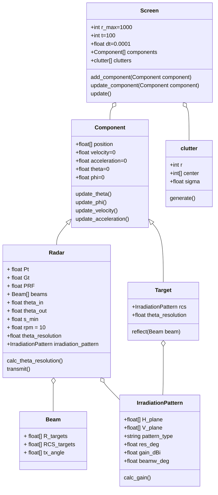

```mermaid
classDiagram
    class Screen{
        +int r_max=1000
        +int t=100
        +float dt=0.0001
        +Component[] components
        +clutter[] clutters

        add_component(Component component)
        update_component(Component component)
        update()
    }
    Screen o-- Component
    Screen o-- clutter


    class Component{
        <!-- responsavel por organizar os components em tela-->
        +float[] position
        +float velocity=0
        +float acceleration=0
        +float theta=0
        +float phi=0

        update_theta()
        update_phi()
        update_velocity()
        update_acceleration()
    }
    Component <|-- Radar
    Component <|-- Target

    class Radar{
        <!-- instância do objeto radar-->
        + float Pt
        + float Gt
        + float PRF
        + Beam[] beams
        + float theta_in
        + float theta_out
        + float s_min
        + float rpm = 10
        +float theta_resolution
        +IrradiationPattern irradiation_pattern
        
        calc_theta_resolution()
        transmit()
    }
    Radar o-- Beam
    Radar o-- IrradiationPattern

    class Target{
        +IrradiationPattern rcs
        +float theta_resolution

        <!-- instância do objeto alvo-->        
        reflect(Beam beam)
    }
    Target o-- IrradiationPattern

    class clutter{
        <!-- gera ruido na tela em formato circular -->
        +int r
        +int[] center
        +float sigma

        generate()
    }

    class IrradiationPattern{
        <!-- responsavel por definir o formato de irradiação do radar / rcs do alvo-->
        +float[] H_plane
        +float[] V_plane
        +string pattern_type
        +float res_deg
        +float gain_dBi
        +float beamw_deg

        calc_gain()
    }
    
    
    class Beam{
        <!-- responsavel por armazenar a resposta do radar em cada ponto do espaço -->
        + float[] R_targets
        + float[] RCS_targets
        + float[] tx_angle
        
        <!-- TODO: ADICIONAR SUPORTE A PASSAGEM POR CLUTTER, MEDINDO DISTÂNCIA-->
    }


```