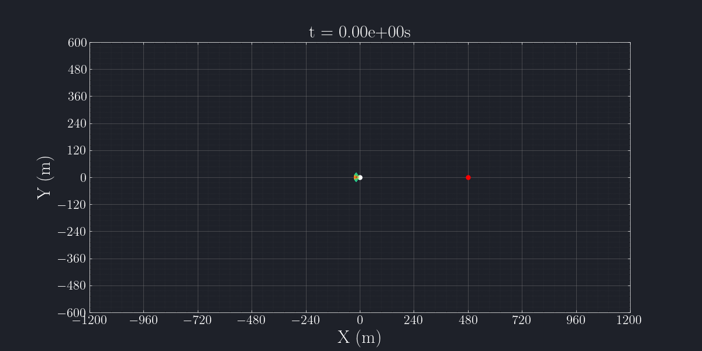

# Radar Utils Library

A open-source library for Python 3 providing tools and equations for analysis and simulation of radar systems.

--- 

  

The library and simulation components was designed to reproduce the main aspects and challenges of radar systems, incorporating fundamental concepts, such as:

- Signal modulation, coding and synchronization techniques  
- Channel modeling, including noise, interference and attenuation

---

